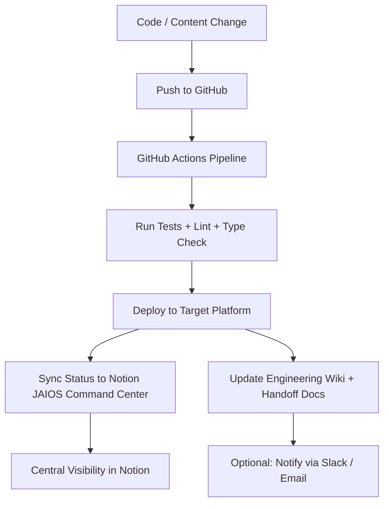

# Universal JAIOS Update & Sync Protocol

**Single Source of Truth for All JenR8ed AI / Agentic Projects**

**Version:** 2026-07-14
**Owner:** JenR8ed (Jennifer McKinley)
**Purpose:** Ensure consistent deployment, documentation, Notion state, and DNS across the entire JAIOS ecosystem with zero drift.

---

## Core Principles

- **File-System-as-Database (FSAD)**: Code + docs in Git are the source of truth.
- **Single-source staging**: One canonical process for updates.
- **Zero-bloat, zero-trust**: Minimal dependencies, explicit everything.
- **Notion as Live Command Center**: Real-time visibility without manual updates.
- **Hybrid Hosting Strategy**: Right tool for the job.

---

## Hosting Strategy (jenr8ed.live + Sub-projects)

| Subdomain / Purpose       | Platform              | When to Use                          | Notes |
|---------------------------|-----------------------|--------------------------------------|-------|
| `jenr8ed.live` (root)     | Cloudflare Pages     | Static landing / marketing UI       | Current: `jenr8ed-live-ui.pages.dev` |
| `www.jenr8ed.live`        | Cloudflare Pages     | Canonical marketing site            | Redirect root → www (or vice versa) |
| `app.jenr8ed.live`        | Vercel               | Dynamic JAIOS app (terminal, agents) | Primary application |
| `link.jenr8ed.live`       | Dub.co               | Branded short links / affiliates    | Migrate from TinyURL |
| `cloud.jenr8ed.live`      | TBD / Cloudflare     | Internal tools / APIs               | Evaluate per use case |
| Individual project homepages | Vercel            | `ai-agentic-terminal-portfolio`, `jaios-*` repos | Keep for now, wire custom domains later |

**DNS Management**: Always in Cloudflare (nameservers at Porkbun). Use Proxied records + Page Rules.

---

## Universal Update Workflow

### Standard Steps (for every JAIOS project)

1. **Make change** in the relevant repo.
2. **Commit + Push** with clear conventional commit message.
3. **GitHub Actions** automatically:
   - Runs quality gates
   - Deploys to correct platform (Vercel / Cloudflare Pages / Dub)
   - Calls deploy-kit sync scripts
4. **Notion** is updated automatically (status, deployment URL, last updated, platform).
5. **Docs** (this handoff + Engineering Wiki) stay in sync via the same pipeline.

---

## Required Files in Every JAIOS Repo

Every JAIOS project should eventually include or reference:

- `.github/workflows/deploy.yml` (standard pipeline from this kit)
- Reference to `jenr8ed-deploy-kit` (submodule, template copy, or script import)
- `README.md` with deployment + Notion sync badges
- Contribution guide that points to this universal protocol

---

## Notion Integration (JAIOS Command Center)

- Central database: **JAIOS Command Center**
- Key properties to track:
  - Project Name
  - Repo URL
  - Deployment URL
  - Platform (Vercel / Cloudflare Pages / Other)
  - Status (Live / In Progress / Needs Attention)
  - Last Updated
  - DNS / Subdomain
  - Notes / Blockers
- Scripts in `notion/` folder of this kit will handle updates via Notion API.
- Manual fallback: Use the Engineering Wiki page for quick state logging.

---

## DNS & Domain Updates

1. All changes to DNS go through **Cloudflare dashboard** (or via API in future scripts).
2. After any deployment change that affects custom domains:
   - Verify in Cloudflare
   - Update this handoff document
   - Log in Notion Engineering Wiki
3. Current known state (as of 2026-07-14):
   - Root + www → Cloudflare Pages
   - Multiple JAIOS projects → Vercel
   - Migration path for `app.` and `link.` defined above

---

## How to Adopt This Protocol (For New or Existing Projects)

1. Clone or reference `jenr8ed-deploy-kit`.
2. Copy `templates/` files into your repo as needed.
3. Add the standard GitHub Actions workflow.
4. Update your Notion JAIOS Command Center entry.
5. Run the initial sync script (once available).

---

## Future Enhancements (Roadmap)

- One-command resync script: `./scripts/resync-jaios.sh --all`
- Automated DNS verification
- Slack / Discord notifications on deployment + Notion update
- Design system sync from Figma (JAIOS Design System file)
- Full monorepo option for tightly coupled JAIOS components

---

## References

- `jenr8ed-deploy-kit` README
- Notion “🚀 JAIOS Command Center”
- Notion “Unified State Logging Protocol — Engineering Wiki”
- Cloudflare zone for jenr8ed.live
- Current Vercel deployments (visible in repo homepages)

**Last Updated**: 2026-07-14 by Grok (via MCP tools audit)

---

*This document is the canonical handoff for all future JAIOS work. Update it first when the protocol evolves.*